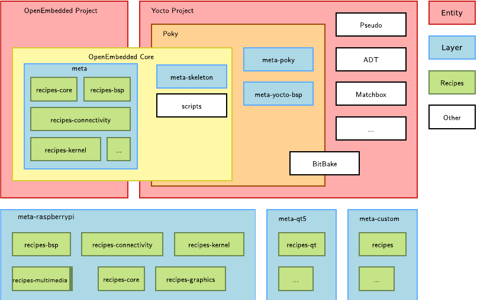
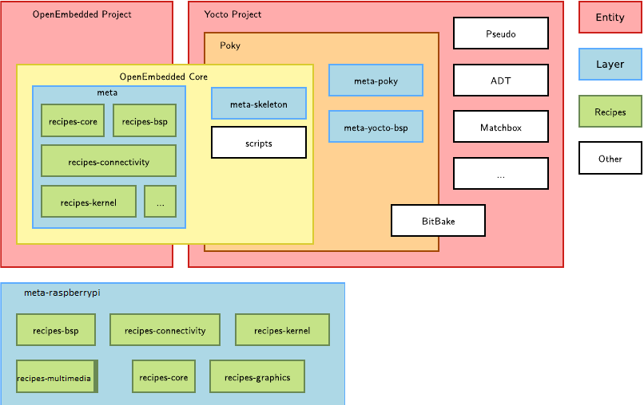

# Yocto-pi4-tutorial : This tutorial discusses the basics of yocto and how to use it with raspberry pi 4

## Introduction 

### Linux Build System
Before introducing Yocto it's usefull to get an overview of the linux system architecture and how to build it, The basic architecture of linux system consists of four main layers(Fig 1) , Start at the bottom we have the **Hardware layer** which basically the hardware that the linux image will run on it (in our case it will be the Raspberry pi 4) , then it comes the **Bootlader layer** which has the main role to load the kernel image and device tree blob from whatever kind of sources ( e.g NAND flash, SD card, USB , Remotly using tftp protocol ,..) to the main memory and passes some kind of parameter to the kernel ( kernel command line ) then start the kernel , The next layer is the **Linux kernel** itself which contains the task managment , filesystems , device drivers and so in . 
After the linux kernel starts and initialize all its subsystems and hardware peripherals it will mount the root filesystem and starts running the init script found in the **Userspace layer**


*[Fig 1 The linux system architecture ( [Bootlin yocto project training](https://bootlin.com/training/yocto/) )]*

The role for the embedded linux integrator is to build all these layers , e.g the integrator will start with the bootloader that support the hardware 
configure it , cross-compile and build it same also for the linux kernel and will select the type of the init system (sysvinit, systemd ..) then selects the ser of packages that he wants to include into the root filesystem and cross-compile and build them . 

This process can be done manually but it has many disadvantages :

1- Complexity :
\[The most complex part in this process is the part for building the userspace packages , you may want to use package A but this package depend on two libraries B and C so you have to start with building B & C then give the location of their headers to A when building it , and as you can seen when the number of packages and dependencies increase the build will be more complex to be done manually ] 

2-Difficult to repreduce :

\[Such a proccess can take days to be done (depends on the size of the project) and same also to repreduce it manually ]

Although all these disadvantages its highly recommended to start building small system manaully before using build tool like yocto just to know the process in depth and to touch with some build toola like autoconf and cmake also this will help you later debug issues found when you are using yocto.

The second option to use is a build system that will automate the whole process and at the same time guarantee high degree of flexibility to fine tune all things , there are many build systems exist (e.g buildroot , yocto , PTXdist ..) here we are interested in yocto.  

### Yocto project concepts

The basic units of the yocto project are **Recipe** and **BitBake** schedular, i'd like to presents both of them then building more concepts on them later.
So what's recipe ? i keep it simple and says that a recipe is a file with extension .bb that describes how to fetch , configure , compile and install a package 
Let's see an example of a recipe , as the tradition of using Hello World for the first example i'll keep it and show the Hello World recipe ! 

hello-world_2.bb ==>
```
###################################
DESCRIPTION = "Hello world program"
HOMEPAGE = "http://example.net/hello/"
PRIORITY = "optional"
SECTION = "examples"
LICENSE = "GPLv2"
SRC_URI = "git://git.example.com/hello;protocol=https"
SRCREV = "2d47b4eb66e705458a17622c2e09367300a7b118"
S = "${WORKDIR}/git"
LIC_FILES_CHKSUM = "file://LICENSE;md5=25cf44512b7bc8966a48b6b1a9b7605f"

do_compile() {
  oe_runmake
}

do_install() {
  install -d ${D}${bindir}
  install -m 0755 hello ${D}${bindir}
}
####################################
```
Variables [**DESCRIPTION**,**HOMEPAGE**,**LICENSE**] describe what's the purpose of the package, where is the homepage and what kind of license it support respectively , while variables **SRC_URI** & **SRCREV** describe where to locate the package ( the first one says that it's located on git repo "git://git.example.com/hello" while the second one says that we are using commit id = 2d47b4eb66e705458a17622c2e09367300a7b118 )  
Now we described the package and specified from where to download it , it's the time to compile & install it.
As you can see we have two functions (in yocto they are called tasks) the first one to compile the application (**do_compile**) and the second one to install it (**do_install**), 
For compiling the app we are using **oe_runmake** which for simplicity run the Makefile for the package to compile it , then after the package is compiled the do_install specifies where to install the package into the root filesystem ( here it will be /usr/bin/hello ) 

*As the goal is not to know how to write a recipe but to touch on the concept of recipe in yocto , i skipped the definition of some variables (e.g S , LIC_FILES_CHKSUM )*

The task of the bitbake schedular is to interpret the recipe and execute all tasks inside it (download , configure , compile and install).

Every package in yocto is descriped using a recipe file 
e.g :   
linux-raspberrypi_5.4.bb : A recipe that describes how to fetch , configure ,compile and install the linux kernel version 5.4 for raspberrypi  
bootfiles.bb : A recipe for raspberry pi bootloader  
dhcp_4.4.2.bb : A recipe for DHCP package  
...  
In yocto recipes that are related to the same topic grouped under one folder and call it recipes-\<feature\> e.g :  
 Recipes like dhcp , bluez5 ( bluetooth 5 ) and openssh , provide connectivity so we can group them under one folder called recipes-connectivity  
 also recipes-bsp folder contains set of recipes for board support packages (e.g grup , u-boot )   
We can group all these folders under the same directory and we call it a **layer** .  
So **layer** is a set of recipes that are used for a common purpose and by convention the name of the layer starts with the keyword "meta"   
Examples of layers :   
meta-raspberry layer : Contains a set of recipes specific for the raspberry pi boards (bsp layer)
meta layer : Contains common set of recipes that we can build on it  
meta-qt5 layer : Contains set of recipes to add support of QT5 into your image   
meta-skeleton : Contains template recipes for BSP and kernel development.  

The yocto project consists of the Poky layer which itself contains other layer called OpenEmbedded Core layer :  
1- OpenEmbedded Core :  
   Which contains the common set of metadata (recipes recipes, classes, and associated files) to build on it
2- Poky :  
   It defines the defualt distribution to use ( e.g the C library , the kernel version ,list of features to be included into the image)  
   So it serves as a starting point for working with yocto, you can start with the poky distrubution and modify it to match your needs 
   
   
  
*[ Fig 2 Yocto Project layer model ( [Bootlin yocto project training](https://bootlin.com/training/yocto/) )]*

## Procedure

Now it's time to start our use case with building linux image using yocto :  
1- Download the prerequisite packages  : 
```
sudo apt install bc build-essential chrpath cpio diffstat gawk git python texinfo wget gdisk
```
2- Clone the Poky layer (dunfell branch) :
```
mkdir ~/yocto && cd ~/yocto  
git clone -b dunfell http://git.yoctoproject.org/git/poky  
cd poky  
git checkout dunfell-23.0.5
```  
Now you have the poky layer including the OpenEmbedded Core layer plus the bitbake schedular  

3-Clone meta-raspberrypi layer (dunfell branch) :
```
$ mkdir ~/yocto/layers && cd ~/yocto/layers
$ git clone -b dunfell git://git.yoctoproject.org/meta-raspberrypi
$ cd meta-raspberrypi && git checkout 987993209716302eb8f314f69a2a3340555f94d8
```
This is the board support layer for the raspberrypi 

4-Switch to the poky directory and source the oe-init-build-env script to create the build directory (This will change the enviroment of the running shell and add the bitbake to the PATH variable ) :
```
cd ~/yocto/poky
source oe-init-build-env build-rpi/ 
```
After this a new directory called **build-rpi** will be created that contains the conf folder , this conf folder contains two important configuration files :  
**bblayers.conf** : List all layers to be included in your build .  
**local.conf** : Contains the settings for your build ( the machine that you want to build an image for , where to store the downloaded packages ..)  
Through the reamining tutorial we will be editing those to file to customize the build ( you can download these files from [here](https://github.com/Mohamed-Sharaf10/meta-custom/tree/master/conf) )

5-Modify the bblayers.conf to include the meta-raspberrypi layer: 
The bblayers.conf has an enviroment variable called **BBLAYERS** which list the layers to be included in the build we will add the **meta-raspberrypi** layer to the list of 
included layer 
```
$ vi conf/bblayers.conf 

# POKY_BBLAYERS_CONF_VERSION is increased each time build/conf/bblayers.conf
# changes incompatibly
POKY_BBLAYERS_CONF_VERSION = "2"

BBPATH = "${TOPDIR}"
BBFILES ?= ""

BBLAYERS ?= " \
  /home/${USER}/yocto/poky/meta \
  /home/${USER}/yocto/poky/meta-poky \
  /home/${USER}/yocto/poky/meta-yocto-bsp \
  /home/${USER}/yocto/layers/meta-raspberrypi \
  "
```
You can add the layer using the bitbake without the need to modify the bblayers.conf manually (recommended) :
```
bitbake-layers add-layer /home/${USER}/yocto/layers/meta-raspberrypi/
```

Here is a view of the included layers in our build  

  

6-Modify the local.conf file to select **raspberrypi4-64** as the default machine:
By defualt the default machine is 
```
MACHINE ??= "qemux86-64"
```
Replace it with 
```
MACHINE ??= "raspberrypi4-64"
```
Also you can use variable BB_NUMBER_THREADS to specify number of parallel bitbake tasks and PARALLEL_MAKE for number of parallel process when compiling  
i kept the default which is the equal to the number of cpu cores (for my case i7) but you can increase it up to 20 .
```
BB_NUMBER_THREADS = "7"
PARALLEL_MAKE = "-j 7"
```
Another tip is to spicify the download directory outside the build directory to be shared with multiple builds 

```
DL_DIR ?= "${TOPDIR}/../../downloads"
``` 
So when bitbake download a recipe it will store it in /home/${USER}/yocto/downloads/ (later when you create a new build for different board you can use the same directory location and make use of already installed packages)

7- Add dropbear package into the image : 
 Dropbear is a lightweight implementation of the ssh , we will include it into the final image to access the target remotly via ssh  
 **Image** in yocto is a recipe that contains a list of packages to be installed in the root filesystem , yocto comes with default set of images like  
 core-image-minimal.bb : A small image just capable of allowing a device to boot.  
 core-image-sato.bb : An image with Sato support  
 .. and more , here we will use the core-image-minimal but this image doesn't contain the dropbear package into the set of installed packages , 
 There are multiple  ways to add an extra package to an image we will start with simplest one ( but not the best option as we will see later ).  
 Again edit local.conf file with adding the following line  
 ```
  IMAGE_INSTALL_append = " dropbear"
 ```
 **IMAGE_INSTALL** is a variable that contains the list of packages to be installed into the target , here we append the dropbear package to this list.  
 Now there will be a dropbear package installed into the output image to be able to connect to the board remotly using ssh , but to do so it's better to have a static ip for the board network interface , the **interfaces** configuration file ( installed in /etc/network/ on the target) is responsible for configuring the network interfaces ,we will use it to configure interface eth0 with static ip = 192.168.0.100 (check the manual [here](https://wiki.debian.org/NetworkConfiguration) for more information)
   
 The **interfaces** file is provided using the recipe init-ifupdown_1.0.bb which is included by default into the core-image-minimal image , let's take a look on a portion of it 
 
 ```
 $ cat ~/poky/meta/recipes-core/init-ifupdown/init-ifupdown_1.0.bb 
 
 SRC_URI = "file://copyright \
            file://init \
            file://interfaces \
            file://nfsroot"
 
 S = "${WORKDIR}"
 
 do_install () {
 	install -d ${D}${sysconfdir}/init.d \
 			${D}${sysconfdir}/network/if-pre-up.d \
 			${D}${sysconfdir}/network/if-up.d \
 			${D}${sysconfdir}/network/if-down.d \
 			${D}${sysconfdir}/network/if-post-down.d
 	....
 	install -m 0644 ${WORKDIR}/interfaces ${D}${sysconfdir}/network/interfaces
 	....
 }
 ```
 The SRC_URI variable contains the interfaces file and inside the do_install task it install this file into /etc/network/   
 The location of the interfaces file is found in (~/poky/meta/recipes-core/init-ifupdown/init-ifupdown-1.0) , let's take a look on portion of it   
 
 ```
 $ cat ~/poky/meta/recipes-core/init-ifupdown/init-ifupdown-1.0/interfaces  
 
 # Wired or wireless interfaces
 auto eth0
 iface eth0 inet dhcp
 iface eth1 inet dhcp
 ```
 
 Here auto means that interface eth0  will be initialized by the init script and the next line says that eth0 will use the dhcp server to get its ip dynamically but we don't need to do this.  
 Ok so now we know the issue and the solution may be simple just edit this file ? **No** we shall not edit any files from the meta layer(or any layer provided to us) , as i said this layer provide a common recipes that we can build on it (Not modifying it)  and yocto provide a mechanism for customizing a recipe without editing it using **the append file**   
 Append file is a file with extension .bbappend that used to customize a recipe , so let's say that you have a recipe called **hello-world_2.bb** provided in layer called **meta-custom** ( like the one we show earlier ) and you want to change the recipe by extending the do_install task to add a configuration file in /etc/hello ( which wasn't provided by the original recipe ) you can do this easly by creating an append file called **hello-world_2.bbappend** with the following content :  
 ```
 SUMMARY = "Add configuration file for Hello program" 
 DESCRIPTION = "This appended recipe will add the hello.conf file in /etc/hello/hello.conf "
 
 FILESEXTRAPATHS_prepend := "${THISDIR}/${BP}:"
 
 SRC_URI += "file://hello.conf"
 
 do_install_append() {
 
 	install -d ${D}${sysconfdir}/hello
 	install -m 0644 ${WORKDIR}/hello.conf ${D}${sysconfdir}/hello/hello.conf
 }
 ```
 And as a rule any recipe or appended recipe shall be inside a layer , we will create a new custom layer that hold this appended recipe  
 
 For init-ifupdown_1.0.bb recipe we can have an append recipe called init-ifupdown_1.0.bbappend ( we will create a layer for it ) that looks like this :    
 ```
 SUMMARY = "Configure static ip address for the ethernet interface"
 DESCRIPTION = "This appended recipe will configure the ethernet port for the pi with static ip address"
 
 FILESEXTRAPATHS_prepend := "${THISDIR}/${BP}:"
 
 SRC_URI += "file://interfaces_ip"
 
 do_install_append() {
 
 	rm ${D}${sysconfdir}/network/interfaces
 	install -m 0644 ${WORKDIR}/interfaces_ip ${D}${sysconfdir}/network/interfaces
 }
 ```
 This append recipe will add a new interfaces file called interfaces_ip to the list of downloaded files and extend the do install task using do_install_append 
 in order to remove the previous one and install the new one .  Any recipe should be inside a layer so we will create our custom layer now 
  
 ```
 $ bitbake-layers create-layer /home/${USER}/yocto/layers/meta-custom/ 
 ```
 Yocto will create a simple layer , let's take a look on its content :  
 ```
 $ cd /home/${USER}/yocto/layers/meta-custom/
 $ cat conf/layer.conf 
 # We have a conf and classes directory, add to BBPATH
 BBPATH .= ":${LAYERDIR}"
 
 # We have recipes-* directories, add to BBFILES
 BBFILES += "${LAYERDIR}/recipes-*/*/*.bb \
             ${LAYERDIR}/recipes-*/*/*.bbappend"
 
 BBFILE_COLLECTIONS += "meta-custom"
 BBFILE_PATTERN_meta-custom = "^${LAYERDIR}/"
 BBFILE_PRIORITY_meta-custom = "6"
 
 LAYERDEPENDS_meta-custom = "core"
 LAYERSERIES_COMPAT_meta-custom = "dunfell"
 ```
 It extends the BBFILES variable to include all recipes and appended recipes , also it specify that the layer is compatible with dunfell branch so if you try to use it with other layers that are not compatible with the dunfell branch the build will fail.  
 
 we will create **recipes-core** directory that will contains the init-ifupdown_1.0.bbappend recipe 
 
 ```
 $ cd /home/${USER}/yocto/layers/meta-custom/
 ```
 You can download the layer from [here](https://github.com/Mohamed-Sharaf10/meta-custom).
 
 Add the meta-cutom to the bblayers.conf
 
 ```
 $ cd ~/yocto/poky 
 $ bitbake-layers add-layer /home/${USER}/yocto/layers/meta-custom/
 ```
 Here is the current view of the included layers   
   
 *[ meta-custom contains the recipes-core which contains the init-ifupdown_1.0.bbappend that appends init-ifupdown_1.0.bb inside the meta layer ]*

8- Build the core-image-minimal image : 
 
 ```
 $ cd ~/yocto/poky
 $ source oe-init-build-env build-rpi/ 
 $ bitbake core-image-minimal 
 ```
 This step will take a long time , in meantime we can start formating the SD card 

9- Format the SD card to create the BOOT & ROOT directories 

 Open a new terminal and type : 
 ```
 $ dmesg -w 
 ```
 This will show the system log continuously , plugin the SD card and notice the name of the device 
 
 ```
 [147634.362474] sd 2:0:0:0: [sdc] 31037440 512-byte logical blocks: (15.9 GB/14.8 GiB)
 ```
 So my sd card under device name **sdc** , this step is very important if you choose wrong device name you may corrupt other paritions  
 
 Unmount all SD card exisiting partitions : 
 ```
 $ sudo umount /dev/sdc*
 ``` 
 
 Clear the existing partition table 
 ```
 $ sudo dd if=/dev/zero of=/dev/sdc bs=1M count=256
 ```
 this step may take time depending on the speed of the sd card . 
 
 Partition the SD card 
 ```
 $ sudo cfdisk /dev/sdc
 
 select lable type: dos 
 then [New] Partition size: 150M & [primary] & type W95 FAT32 
 then [New] Partition size will be the remaining & [primary] & type 83 Linux
 type [write]  to save and [Quit]
 ```
 Create the filesystems 
 ```
 $ sudo mkfs.vfat -F 32 -n BOOT /dev/sdc1 
 $ sudo mkfs.ext4 -L ROOT -E nodiscard /dev/sdc2
 press [ENTER] after this line 
 ```
 unplug & plug the SD card again and the two partition will be mounted into the following directories 
 ```
 /media/${USER}/BOOT
 /media/${USER}/ROOT
 ```
10 - Configue your network interface 
The network interface that will be connected to the PI shall be in the same subnet  

```
nmcli con add type ethernet ifname <interface> ip4 192.168.0.1/24

Replace interface with the interface name which you can get using ifconfig or ip link show, in my pc it was enp3s0
```
11 - Copy the linux image + bootfiles into the BOOT partition 
 After the build finishes (step 8 )  all images will be installed into this directory ~/yocto/poky/build-rpi/tmp/deploy/images/raspberrypi4-64
 let's copy the bootfiles and the kernel image into the BOOT partition 
 ```
 $ cd ~/yocto/poky/build-rpi/tmp/deploy/images/raspberrypi4-64 
 $ sudo cp bootfiles/*.elf  /media/msharaf/BOOT/  
 $ sudo cp bootfiles/*.dat  /media/msharaf/BOOT/
 $ sudo cp bootfiles/bootcode.bin /media/msharaf/BOOT/
 $ sudo cp Image  /media/msharaf/BOOT/kernel8.img 
 $ sudo cp bcm2711-rpi-4-b.dtb  /media/msharaf/BOOT/
 ```
 The \*.elf & \*.dat files are used to initialize the GPU while the **bootcode.bin** is the bootloader image and **Image** is the kernel image , the last file is the device tree blob (The binary format of the device tree) .  
 Two important configuration files shall be copied to the BOOT partition :  
 1 - **cmdline.txt** : The kernel command line will be written here and passed to the kernel by the bootloader 
 2- **config.txt** : This file contains the settings for the rasberry pi board , here you can disable/enable and edit the settings for the peripherals (consider it like your PC BIOS but without GUI )
 
 To be able to see the kernel logs i'll connect usb_to_ftdi cable to the raspberry pi UART 1 as shown here :  
 
   
 
*[The black will be connected to the GND , Yellow to the Cable RX while Orange will be connected to the TX pin ]*
 
 That's not the whole thing , you need to edit the config.txt to enable the uart , add the following line to the config.txt  
 ```
 enable_uart=1 
 ````
 And the following line to the **cmdline.txt**  
 ```
 console=serial0,115200 console=tty1
 ```
 Now copy the cmdline.txt and config.txt to the BOOT partition  
 ```
 $ sudo cp bootfiles/config.txt /media/msharaf/BOOT/
 $ sudo cp bootfiles/cmdline.txt /media/msharaf/BOOT/
 ```
 While this will make things work but this is not the yocto why to modify generated files , you shall look at the recipe that provides the config.txt & cmdline.txt then make an appeneded recipe that will change the content of the two files to match your need  
 
12 - Copy the root filesystem image into the ROOT partition 
 
 ```
 $ sudo tar xf core-image-minimal-raspberrypi4-64.tar.bz2 -C /media/msharaf/ROOT
 ```
 
13 - Setup the board 
  1 Connect the ethernet cable to your board and to your PC interface  
  2 Connect the USB to FTDI cable to your PC 
  3 Open a terminal on the connected USB port to see the log 
  ```
  sudo picocom -b 115200  /dev/ttyUSB0
  ```
  4 Switch the power on , you should the kernel logs at the terminal 
  5 Open a new terminal and request an access to the ssh 
  ```
  $ ssh-keygen -f "/home/msharaf/.ssh/known_hosts" -R "192.168.0.100"
  $ ssh root@192.168.0.100


  
# Resources  
1- https://www.yoctoproject.org/docs/current/mega-manual/mega-manual.html  
2- https://bootlin.com/training/yocto/  
3- https://lancesimms.com/RaspberryPi/HackingRaspberryPi4WithYocto_Introduction.html  
